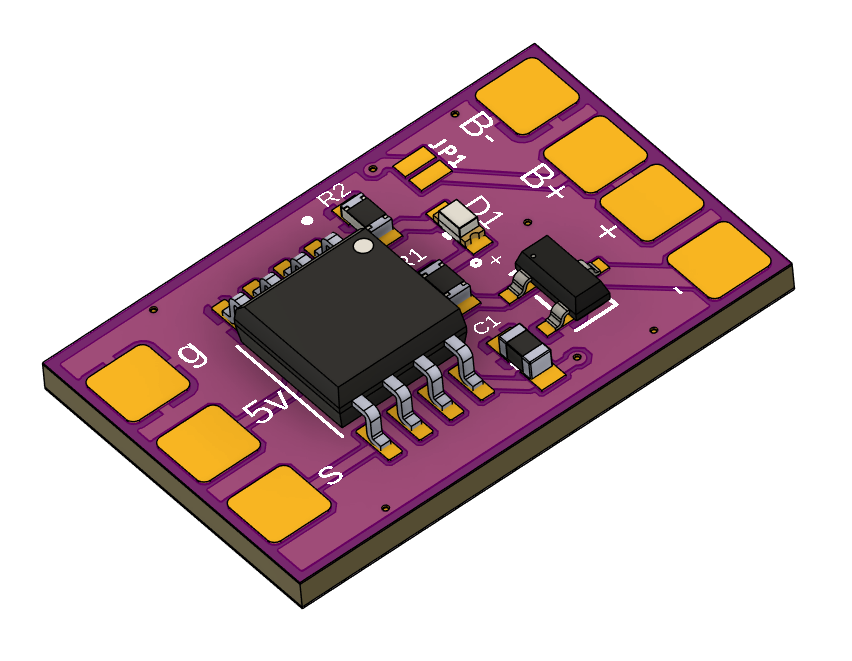

# ATtiny RC Switch

On/Off Switch for RC models driven by PWM signal. Based on ATtiny85, 12V capable. Original project is located [here](https://github.com/DzikuVx/attiny_rc_switch).

This small device allows to turn on/off different devices on RC devices: airplanes, quadcopter drones, cars. 
It uses one RC PWM channel as input and provides power on output pins when channel pulse length is above 1700us.
Excellent to switch LED strips. Output current is up to 500mA.

AVR ATtiny x5 series microcontroller. Compiled code takes slightly above 2kB, so will fit into ATtiny45 and ATtiny85. When smoothing is removed, code will fit into ATtiny25.

To program you can use the [AVR Pocket Programmer](https://www.digikey.com/en/products/detail/sparkfun-electronics/09825/5230949), which costs $20. It is easiest to use a clip to program the microcontroller such as [these](https://www.amazon.com/EC-Buying-Detachable-Programmer-Testing/dp/B0C73GXRR2) or [these](https://www.amazon.com/Programmer-Testing-SOP16-SOIC8-SOIC16/dp/B0CBNG59CB).

## ATtiny RC Switch SMD

Order the PCB [here](https://oshpark.com/shared_projects/eeDahjbz)

## Hardware

### BOM

| Label |Part No    | Name     | Quantity | Subtotal | Link   |
|-------|-----------|----------|----------|----------|--------|
| U1 | ATTINY85-20SU | ATtiny85 Microcontroller | 1 | $1.50 | [DigiKey](https://www.digikey.com/en/products/detail/microchip-technology/ATTINY85-20SU/735470) |
| U2 | IRLML2502TRPBF | N-Channel MOSFET, 20V, 4.2A SOT-23 | 1 | $0.43 | [DigiKey](https://www.digikey.com/en/products/detail/infineon-technologies/IRLML2502TRPBF/812502) |
| D1 | LTST-C190KRKT | Red LED, SMD 0603, Clear | 1 | $0.14 | [DigiKey](https://www.digikey.com/en/products/detail/liteon/LTST-C190KRKT/386817) |
| R1,R2 | CRGCQ0603F470R | 470 Ohm Resistor, SMD 0603, 1/10W | 2 | $0.20 | [DigiKey](https://www.digikey.com/en/products/detail/te-connectivity-passive-product/CRGCQ0603F470R/8576286) |
| C1 | CC0603KRX7R7BB104 | 0.1uF Capacitor, SMD 0603, 16V | 1 | $0.08 | [DigiKey](https://www.digikey.com/en/products/detail/yageo/CC0603KRX7R7BB104/302822) |
|  |  |  | Total | $2.35 |  |

### Schematic

## ATtiny RC Switch Through Hole

Order the PCB [here](https://oshpark.com/)

## Hardware

### BOM

| Label |Part No    | Name     | Quantity | Subtotal | Link   |
|-------|-----------|----------|----------|----------|--------|
| U1 | ATTINY85-20PU | ATtiny85 Microcontroller | 1 | $1.66 | [DigiKey](https://www.digikey.com/en/products/detail/microchip-technology/ATTINY85-20PU/735469?s=N4IgTCBcDaIIYBcEEsB2BPAHAVgLRgAYAHAVxAF0BfIA) |
| U2 | SS8050DTA | NPN BJT, 25V, 1.5A TO92-3 | 1 | $0.37 | [DigiKey](https://www.digikey.com/en/products/detail/onsemi/SS8050DTA/1047325) |
| D1 | 151033RS03000 | Red LED, Round, 3mm, Clear | 1 | $0.16 | [DigiKey](https://www.digikey.com/en/products/detail/w%C3%BCrth-elektronik/151033RS03000/4490003) |
| R1,R2 | CF18JT470R | 470 Ohm Resistor, 1/8W, Axial | 2 | $0.20 | [DigiKey](https://www.digikey.com/en/products/detail/stackpole-electronics-inc/CF18JT470R/1741717) |
| C1 | A104K15X7RF5TAA | 0.1uF Capacitor, 50V, Axial | 1 | $0.26 | [DigiKey](https://www.digikey.com/en/products/detail/vishay-beyschlag-draloric-bc-components/A104K15X7RF5TAA/146011) |
|  |  |  | Total | $2.65 |  |

### Schematic

## Notes

* Arduino IDE 1.6.6. Should work on older releases, but never tested

* ATtiny45/85 board definitions. Tested with [damellis/attiny](https://github.com/damellis/attiny)

* Uses 1MHz internal osciallator 